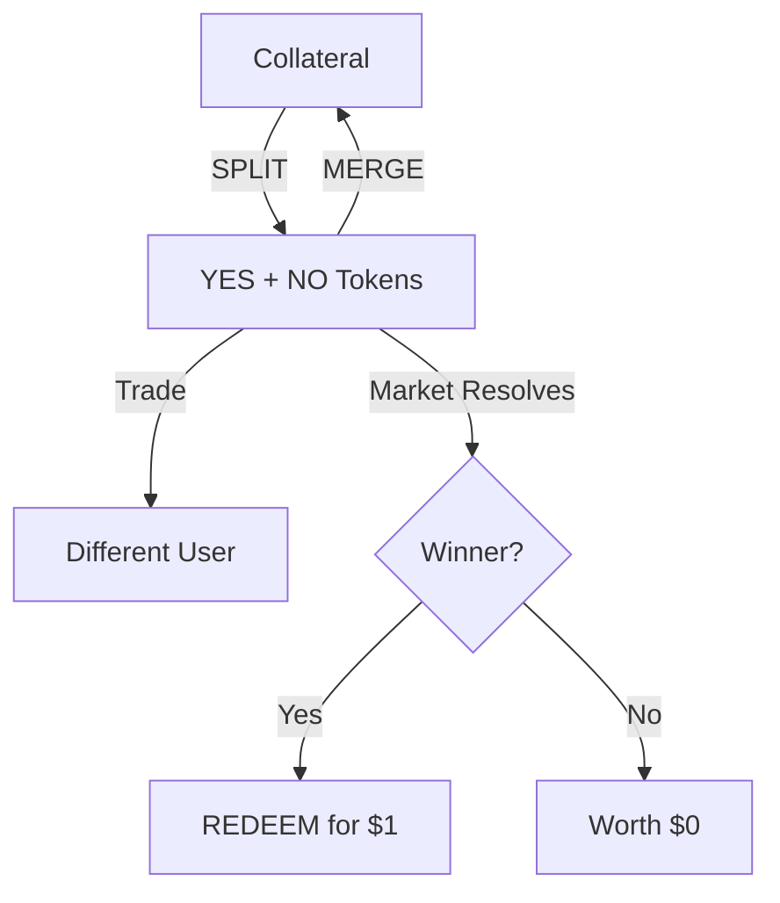

## Overview

Query trading activity for a specific wallet address. This includes minting operations (splits), redemptions (merges, redeems), and position changes.

<ParamField query="user" type="string" required>
  User wallet address (required)
</ParamField>

<ParamField query="market_slug" type="string">
  Filter by market slug
</ParamField>

<ParamField query="condition_id" type="string">
  Filter by condition ID
</ParamField>

<ParamField query="start_time" type="integer">
  Unix timestamp (seconds) for start of range
</ParamField>

<ParamField query="end_time" type="integer">
  Unix timestamp (seconds) for end of range
</ParamField>

<ParamField query="order" type="string" default="desc">
  Sort order: `asc` or `desc` by timestamp
</ParamField>

<ParamField query="limit" type="integer" default="100">
  Number of activities to return (1-500)
</ParamField>

<ParamField query="pagination_key" type="string">
  Pagination key for cursor-based pagination (from previous response)
</ParamField>

<Warning>
Only one of `market_slug` or `condition_id` can be provided.
</Warning>

<ResponseField name="activities" type="array">
  <Expandable title="Activity object">
    <ResponseField name="side" type="string">
      Activity type: `MERGE`, `SPLIT`, or `REDEEM`
    </ResponseField>
    <ResponseField name="market_slug" type="string">Market slug</ResponseField>
    <ResponseField name="condition_id" type="string">Market condition ID</ResponseField>
    <ResponseField name="shares" type="integer">Raw number of shares</ResponseField>
    <ResponseField name="shares_normalized" type="number">Shares / 1,000,000</ResponseField>
    <ResponseField name="price" type="number">Price at time of activity</ResponseField>
    <ResponseField name="tx_hash" type="string">Transaction hash</ResponseField>
    <ResponseField name="title" type="string">Market title</ResponseField>
    <ResponseField name="timestamp" type="integer">Unix timestamp</ResponseField>
    <ResponseField name="user" type="string">Wallet address</ResponseField>
  </Expandable>
</ResponseField>

<ResponseField name="pagination" type="object">
  <Expandable>
    <ResponseField name="limit" type="integer">Requested limit</ResponseField>
    <ResponseField name="count" type="integer">Number of items returned</ResponseField>
    <ResponseField name="pagination_key" type="string">Key for next page (null if no more)</ResponseField>
    <ResponseField name="has_more" type="boolean">Whether more results exist</ResponseField>
  </Expandable>
</ResponseField>

## Activity Types

| Type | Description |
|------|-------------|
| `SPLIT` | User deposited collateral to create YES+NO token pairs |
| `MERGE` | User combined YES+NO pairs back to collateral |
| `REDEEM` | User redeemed winning tokens after market resolution |

<RequestExample>
```bash cURL
curl "https://api.predexon.com/v1/polymarket/activity?user=0x1234...&limit=50"
```

```python Python
import requests

response = requests.get(
    "https://api.predexon.com/v1/polymarket/activity",
    params={
        "user": "0x1234567890abcdef...",
        "start_time": 1704067200,
        "limit": 100
    }
)

activities = response.json()["activities"]

for activity in activities:
    action = {
        "SPLIT": "minted",
        "MERGE": "merged",
        "REDEEM": "redeemed"
    }.get(activity["side"], activity["side"])

    print(f"{action} {activity['shares_normalized']:.2f} shares in {activity['title'][:50]}...")
```

```typescript TypeScript
const response = await fetch(
  `https://api.predexon.com/v1/polymarket/activity?user=${walletAddress}&limit=50`
);
const { activities } = await response.json();
```
</RequestExample>

<ResponseExample>
```json 200
{
  "activities": [
    {
      "side": "SPLIT",
      "market_slug": "will-donald-trump-win-the-2024-us-presidential-election",
      "condition_id": "0x1a2b3c4d...",
      "shares": 1000000000,
      "shares_normalized": 1000.0,
      "price": 0.62,
      "tx_hash": "0xabc123...",
      "title": "Will Donald Trump win the 2024 Presidential Election?",
      "timestamp": 1704153600,
      "user": "0x1234567890..."
    },
    {
      "side": "REDEEM",
      "market_slug": "will-btc-hit-50k-jan",
      "condition_id": "0x5678efgh...",
      "shares": 500000000,
      "shares_normalized": 500.0,
      "price": 1.0,
      "tx_hash": "0xdef456...",
      "title": "Will Bitcoin hit $50k in January 2024?",
      "timestamp": 1704067200,
      "user": "0x1234567890..."
    }
  ],
  "pagination": {
    "limit": 50,
    "count": 50,
    "pagination_key": "eyJ0aW1lc3RhbXAiOjE3MDQwNjcyMDAsInR4X2hhc2giOiIweGRlZjQ1NiJ9",
    "has_more": true
  }
}
```

```json 400
{
  "error": "Invalid filter combination",
  "message": "Only one of market_slug or condition_id can be provided"
}
```
</ResponseExample>

## Understanding Activity Flow


