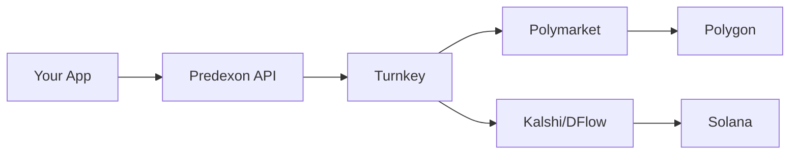
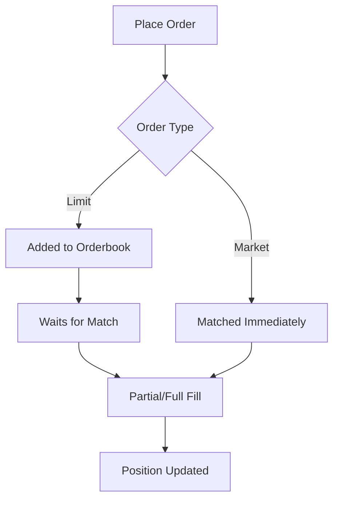
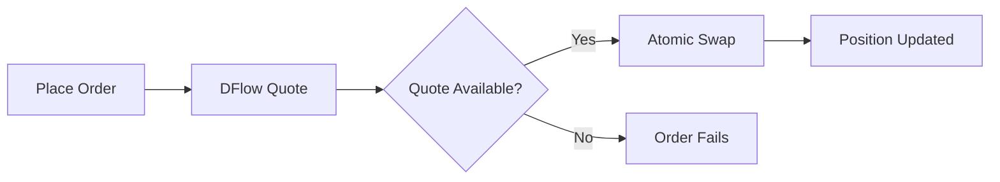
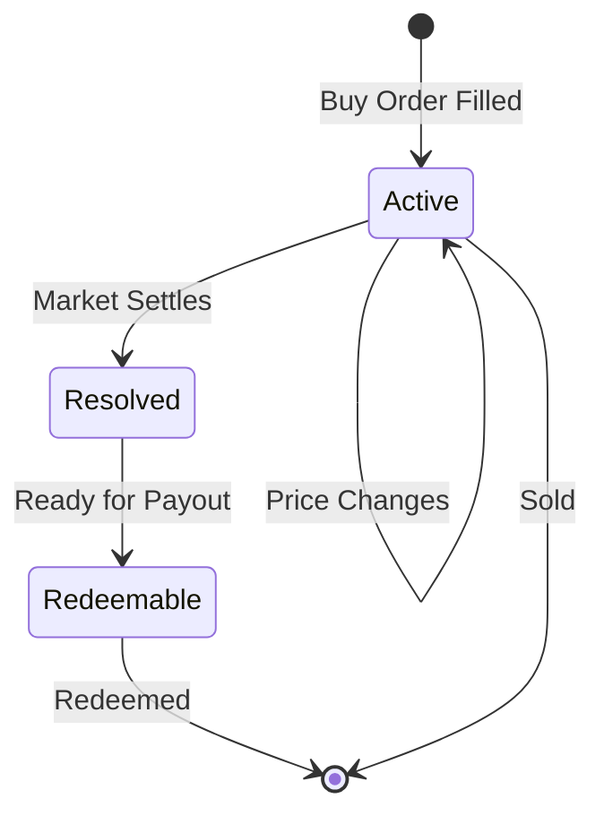

## What is Custodial Trading?

The Predexon Custodial Trading API manages wallets on behalf of users. Instead of requiring users to handle private keys, manage gas, or sign transactions, the API handles all of this automatically.

<CardGroup cols={2}>
  <Card title="Simplified Integration" icon="plug">
    No wallet SDKs or key management needed in your application
  </Card>
  <Card title="Gasless Trading" icon="gas-pump">
    Polymarket trades use gasless relay - no ETH/MATIC required
  </Card>
  <Card title="Multi-Venue" icon="layer-group">
    Single API for trading on Polymarket (Polygon) and Kalshi (Solana)
  </Card>
  <Card title="Secure Custody" icon="shield-halved">
    Keys managed by Turnkey with institutional-grade security
  </Card>
</CardGroup>

## How It Works



1. **Your Application** calls the Predexon Trading API
2. **Predexon API** manages user sessions and routing
3. **Turnkey** securely stores keys and signs transactions
4. **Venue APIs** execute trades on Polymarket or Kalshi
5. **Blockchains** settle transactions on Polygon or Solana

## Wallet Architecture

### Polymarket (Polygon)

Each user gets two components on Polygon:

| Component | Description |
|-----------|-------------|
| **Signing Wallet** | Turnkey-managed EOA that signs transactions |
| **Gnosis Safe Proxy** | Smart contract wallet that holds funds |

The Gnosis Safe address (`polymarketWalletAddress`) is the deposit address. Users send USDC here, and the API uses the signing wallet to authorize trades.

**Why Gnosis Safe?**
- Polymarket requires Safe wallets for trading
- Enables gasless relay (meta-transactions)
- Provides additional security through smart contract controls

### Kalshi (Solana)

Each user gets a single Solana wallet:

| Component | Description |
|-----------|-------------|
| **Solana Wallet** | Turnkey-managed keypair for DFlow swaps |

The Solana address (`solanaWalletAddress`) is the deposit address for Kalshi trading. Users send USDC (SPL) here.

**Key Difference:** Kalshi trading via DFlow requires SOL for transaction fees. Use the [Airdrop SOL](/trading-api/funds/airdrop-sol) endpoint to fund gas.

## Order Execution

### Polymarket Orders

Polymarket uses a Central Limit Order Book (CLOB):



**Order Types:**
- **Limit Orders:** Placed on the orderbook at a specific price, wait for a counterparty
- **Market Orders:** Execute immediately at the best available price

**Execution Model:**
- Orders can be partially filled
- Open orders can be cancelled
- Gasless relay means no ETH/MATIC needed

### Kalshi Orders (via DFlow)

Kalshi uses atomic swaps through DFlow:



**Execution Model:**
- All-or-nothing execution (no partial fills)
- Instant settlement
- Cannot be cancelled (atomic)
- Requires SOL for transaction fees

## Position Lifecycle



| Status | Description | Available Actions |
|--------|-------------|-------------------|
| `active` | Market is still trading | Sell position, monitor P&L |
| `resolved` | Market has settled, outcome determined | View result (won/lost) |
| `redeemable` | Ready for payout | Redeem for USDC |

## Security Model

### Key Management

All private keys are managed by [Turnkey](https://turnkey.com):

- Hardware-backed key storage
- Keys never leave secure enclaves
- Transaction signing happens server-side
- No private keys in your application

### Access Control

The ownership model ensures isolation:

```
API Key A ──┬── User 1
            ├── User 2
            └── User 3

API Key B ──┬── User 4
            └── User 5
```

- Each API key can only access users it created
- Cross-API key access returns 403 Forbidden
- Users cannot access each other's data

## Fee Structure

| Venue | Trading Fees | Gas Fees |
|-------|--------------|----------|
| Polymarket | Per Polymarket CLOB schedule | Gasless (relay covers) |
| Kalshi | Included in DFlow swap | User pays SOL |

<Note>
For Kalshi, use [Airdrop SOL](/trading-api/funds/airdrop-sol) to fund transaction fees before trading.
</Note>

## Comparison to Self-Custody

| Feature | Custodial (Predexon) | Self-Custody |
|---------|---------------------|--------------|
| Key management | Handled by API | You manage |
| Gas fees | Gasless (Polymarket) | You pay |
| Integration complexity | REST API calls | Wallet SDKs + signing |
| Multi-chain support | Unified API | Separate integrations |
| Withdrawal | API call | Direct blockchain tx |

## Best Practices

<Steps>
  <Step title="Store User IDs">
    Save the `userId` from Create User - it's required for all subsequent operations.
  </Step>
  <Step title="Check Balance Before Orders">
    Always verify sufficient funds with Get Balance before placing orders.
  </Step>
  <Step title="Handle Errors Gracefully">
    Implement retry logic with exponential backoff for transient failures.
  </Step>
  <Step title="Monitor Positions">
    Periodically check positions for resolved markets that can be redeemed.
  </Step>
  <Step title="Withdraw Before Deleting">
    Always withdraw funds before deleting a user - the action is irreversible.
  </Step>
</Steps>

## Next Steps

<CardGroup cols={2}>
  <Card title="Create Your First User" icon="user-plus" href="/trading-api/users/create-user">
    Set up a managed wallet
  </Card>
  <Card title="Place an Order" icon="paper-plane" href="/trading-api/trading/place-order">
    Start trading on prediction markets
  </Card>
</CardGroup>
