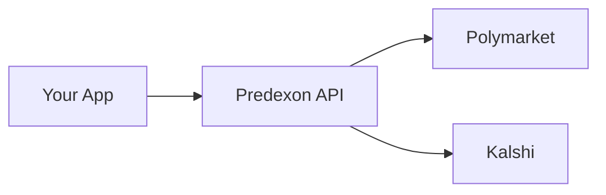

## Overview

Predexon Trading API manages wallets on behalf of users. Instead of requiring users to handle private keys, manage gas, or sign transactions, the API handles all of this automatically.

<CardGroup cols={2}>
  <Card title="Simplified Integration" icon="plug">
    No wallet SDKs or key management needed in your application
  </Card>
  <Card title="Gasless Trading" icon="gas-pump">
    Polymarket trades use gasless relay - no POL required
  </Card>
  <Card title="Multi-Venue" icon="layer-group">
    Single API for trading on Polymarket (Polygon) and Kalshi (Solana)
  </Card>
  <Card title="Secure Key Management" icon="shield-halved">
    Private keys managed by Turnkey - you never handle them
  </Card>
</CardGroup>

## How It Works

1. **Your Application** calls the Predexon Trading API
2. **Predexon API** manages user wallets and executes trades
3. **Venues** settle transactions on their respective blockchains

## Wallet Management

When you create a user, the API generates managed wallets for each venue:

| Venue | Deposit Address | Blockchain |
|-------|-----------------|------------|
| Polymarket | `polymarketWalletAddress` | Polygon (USDC.e) |
| Kalshi | `kalshiWalletAddress` | Solana (USDC) |

Send USDC.e (Polygon) or USDC (Solana) to the appropriate address to fund trading. The API handles all transaction signing automatically.

### Key Security

Private keys are managed by [Turnkey](https://turnkey.com), a secure key management infrastructure:

- **Predexon never sees private keys** - keys are generated and stored in Turnkey's secure environment
- **Hardware-backed security** - keys never leave secure enclaves
- **No key management in your app** - all signing happens server-side

## Order Execution

### Polymarket Orders

Polymarket uses an orderbook:

**Order Types:**
- **Limit Orders:** Placed on the orderbook at a specific price, wait for a counterparty
- **Market Orders:** Execute immediately at the best available price

**Execution Model:**
- Orders can be partially filled
- Open orders can be cancelled
- Gasless relay means no POL needed

### Kalshi Orders

Kalshi orders execute atomically:

**Execution Model:**
- All-or-nothing execution (no partial fills)
- Instant settlement
- Cannot be cancelled (atomic)
- Requires SOL for transaction fees

## Position Lifecycle

Positions move through three stages:

<Steps>
  <Step title="Active">
    Market is still trading. You can sell your position or monitor P&L.
  </Step>
  <Step title="Resolved">
    Market has settled and outcome is determined. Check if you won or lost.
  </Step>
  <Step title="Redeemable">
    Winning positions can be redeemed for USDC via the [Redeem endpoint](/trading-api/positions/redeem-position).
  </Step>
</Steps>

## Security Model

Each API key can only access users it created. Attempting to access another API key's users returns `403 Forbidden`.

## Fee Structure

| Venue | Trading Fees | Gas Fees |
|-------|--------------|----------|
| Polymarket | Per Polymarket schedule | Gasless (relay covers) |
| Kalshi | Included in swap | User pays SOL |

<Note>
Kalshi trading requires SOL for Solana transaction fees.
</Note>

## Comparison to Self-Custody

| Feature | Predexon | Self-Custody |
|---------|---------------------|--------------|
| Key management | Handled by API | You manage |
| Gas fees | Gasless (Polymarket) | You pay |
| Integration complexity | REST API calls | Wallet SDKs + signing |
| Multi-chain support | Unified API | Separate integrations |
| Withdrawal | API call | Direct blockchain tx |

## Best Practices

<Steps>
  <Step title="Store User IDs">
    Save the `userId` from Create User - it's required for all subsequent operations.
  </Step>
  <Step title="Check Balance Before Orders">
    Always verify sufficient funds with Get Balance before placing orders.
  </Step>
  <Step title="Handle Errors Gracefully">
    Implement retry logic with exponential backoff for transient failures.
  </Step>
  <Step title="Monitor Positions">
    Periodically check positions for resolved markets that can be redeemed.
  </Step>
  <Step title="Withdraw Before Deleting">
    Always withdraw funds before deleting a user - the action is irreversible.
  </Step>
</Steps>

## Next Steps

<CardGroup cols={2}>
  <Card title="Create Your First User" icon="user-plus" href="/trading-api/users/create-user">
    Set up a managed wallet
  </Card>
  <Card title="Place an Order" icon="paper-plane" href="/trading-api/trading/place-order">
    Start trading on prediction markets
  </Card>
</CardGroup>
