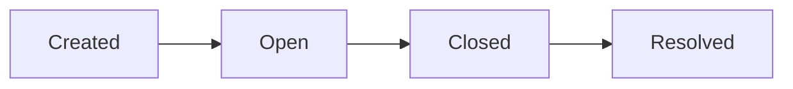

## What is a Prediction Market?

A prediction market is a market where participants trade contracts that pay out based on the outcome of future events. Each market has two sides (typically "Yes" and "No"), and the price of each side reflects the market's implied probability of that outcome.

## Market Structure

### Key Identifiers

Every market in Predexon has several identifiers:

| Identifier | Description | Example |
|------------|-------------|---------|
| `condition_id` | Unique hash for the market condition | `0x1a2b3c...` |
| `market_slug` | Human-readable URL-safe identifier | `will-trump-win-2024` |
| `market_id` | Internal numeric identifier | `12345` |

### Outcomes (Sides)

Each market has exactly two outcomes:

```json
{
  "outcomes": [
    {
      "label": "Yes",
      "token_id": "21742633143463906290569050155826241533067272736897614950488156847949938836455",
      "price": 0.62
    },
    {
      "label": "No",
      "token_id": "48331043336612883890938759509493159234755048973500640148014422747788308965732",
      "price": 0.38
    }
  ]
}
```

<Note>
Prices always sum to approximately 1.0 (there may be slight deviations due to market spread).
</Note>

### Token IDs

Token IDs are crucial for:
- Fetching candlestick data
- Getting market prices
- Tracking wallet positions
- Querying orderbooks

## Market Lifecycle



| Status | Description |
|--------|-------------|
| `open` | Trading is active |
| `closed` | Trading has stopped, awaiting resolution |
| `resolved` | Outcome determined, winning side pays $1 |

## Querying Markets

### Basic Filtering

```python
# Get open markets only
response = requests.get(
    f"{BASE_URL}/v1/polymarket/markets",
    params={"status": "open"}
)

# Filter by price range (unlikely outcomes)
response = requests.get(
    f"{BASE_URL}/v1/polymarket/markets",
    params={
        "min_price": 0.01,
        "max_price": 0.10
    }
)

# Filter by minimum volume
response = requests.get(
    f"{BASE_URL}/v1/polymarket/markets",
    params={"min_volume": 1000000}  # $1M+ volume
)
```

### Sorting Options

| Sort Value | Description |
|------------|-------------|
| `volume` | Total trading volume (default) |
| `open_interest` | Current open interest |
| `price_desc` | Highest price first |
| `price_asc` | Lowest price first |

### Filtering by Tags

Markets can be filtered by category tags:

```python
response = requests.get(
    f"{BASE_URL}/v1/polymarket/markets",
    params={"tags": ["politics", "elections"]}
)
```

Common tags include:
- `politics`
- `crypto`
- `sports`
- `elections`
- `economy`

## Market Metrics

### Volume

**Total Volume** (`total_volume_usd`) represents the cumulative USD value of all trades in the market's history.

```python
# Get top 10 markets by volume
response = requests.get(
    f"{BASE_URL}/v1/polymarket/markets",
    params={
        "sort": "volume",
        "limit": 10
    }
)
```

### Open Interest

**Open Interest** (`open_interest_total`) is the total value of outstanding positions - tokens that have been minted but not yet redeemed.

```python
# Get markets with high open interest
response = requests.get(
    f"{BASE_URL}/v1/polymarket/markets",
    params={
        "sort": "open_interest",
        "min_open_interest": 500000
    }
)
```

### Liquidity

**Liquidity** (`liquidity_usd`) measures the depth of the orderbook - how much can be traded without significant price impact.

## Working with Multiple Markets

### Batch Lookups

Query multiple markets by ID in a single request:

```python
response = requests.get(
    f"{BASE_URL}/v1/polymarket/markets",
    params={
        "condition_id": [
            "0x1234...",
            "0x5678...",
            "0x9abc..."
        ]
    }
)
```

### Event-Based Grouping

Markets related to the same event share an `event_slug`:

```python
# Get all markets for a specific event
response = requests.get(
    f"{BASE_URL}/v1/polymarket/markets",
    params={"event_slug": "2024-presidential-election"}
)
```

## Next Steps

<CardGroup cols={2}>
  <Card title="Candlesticks" icon="chart-candlestick" href="/api-reference/markets/candlesticks">
    Get historical price data
  </Card>
  <Card title="Orderbooks" icon="book-open" href="/api-reference/markets/orderbooks">
    Access orderbook snapshots
  </Card>
</CardGroup>
